# 02a. 🧩 Importing Skills for Watson Assistant
## 💻 BUS 118I Digital Innovation

---

## 🎯Learning Goal: 

- Important skills to Watson Assistant instance
- Launch your Watson Assistant

---

## ⏱️Estimated time: 
- 15 minutes

---

## 🪜Steps: 

1. Click **“Create new +”** in the drop down arrow next to My first assistant. 

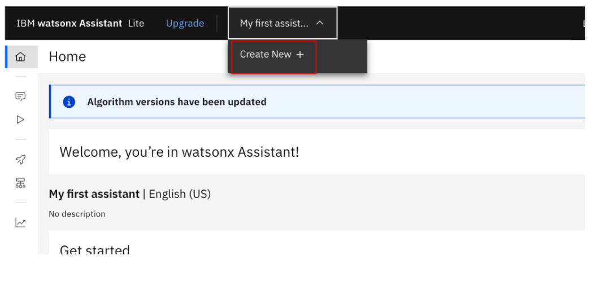

2. Name the Watson Assistant instance “COVID Crisis Communication”, and click on **“Create assistant”.**

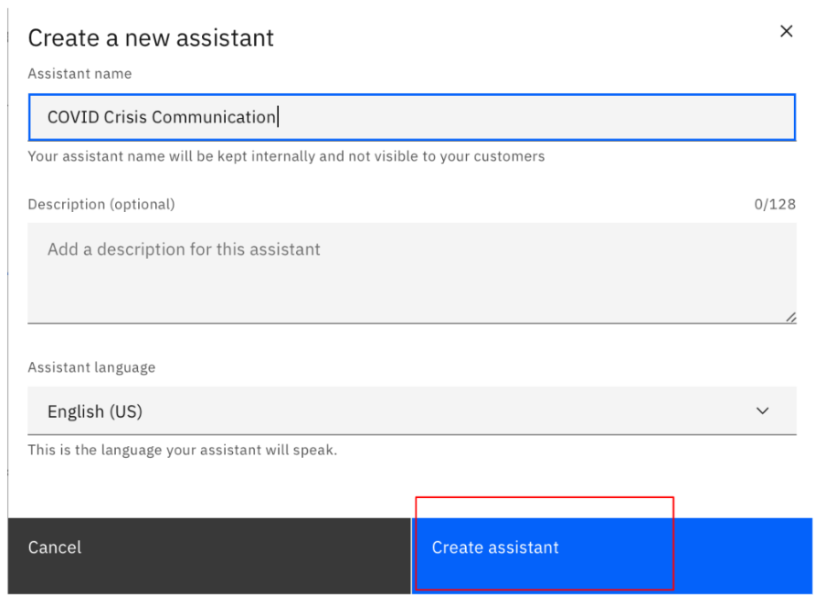 

3. On the side bar, click on **“Assistant settings”.**

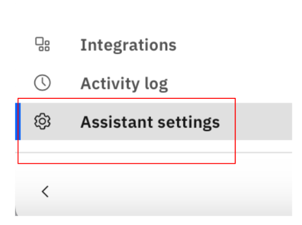

4. Scroll down and click on **“Activate dialog”**. Click on **“Activate dialog”** again on the pop-up.

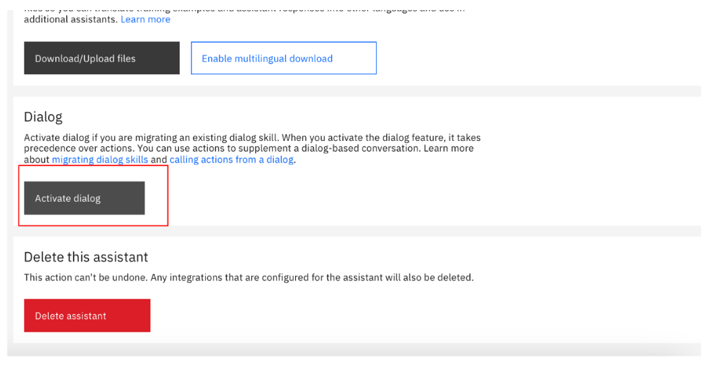

5. On the side bar, click on the new **Dialog** button.

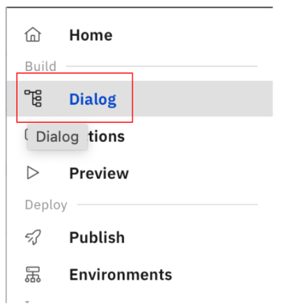

6. Click **Upload / Download** and use the “skill-CDC-COVID-FAQ” JSON file provided on Canvas and upload it. Click on **“Upload and replace”** on the pop-up

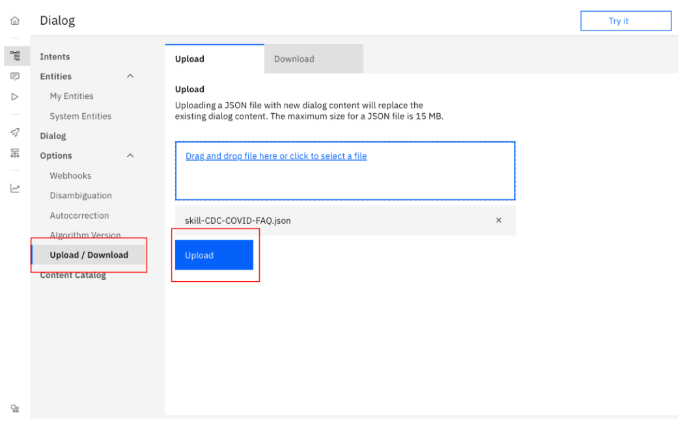 

7. Click on the **Try it** button in the top right corner to get a link to test your assistant.

8. Exit out of the preview page. Once you have successfully imported the file, click on the dialog skill then click on the **Intents** tab on the left bar and explore what content exists here. 

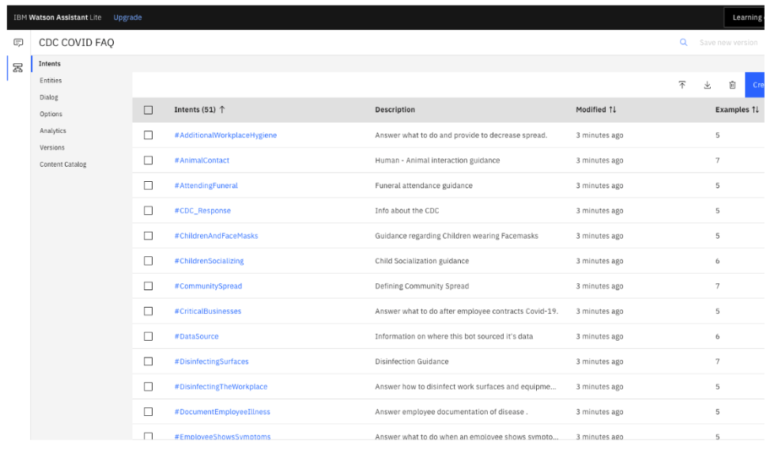

9. Then click on the **Dialog** tab on the left bar and check what content exists there. We will learn about intents, entities, and dialog in the next exercise.

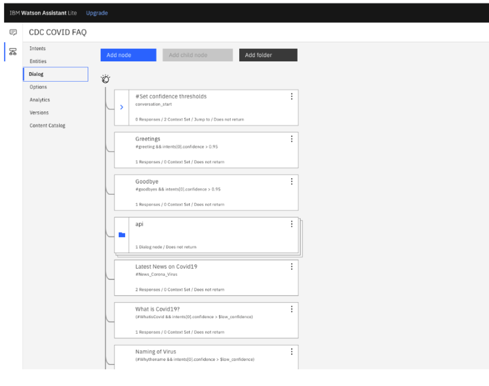 

10. Modify the **Greetings** node to include your name.

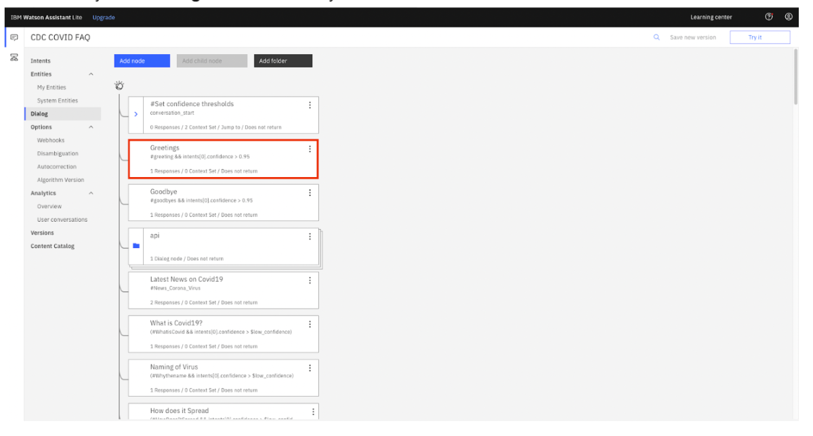

**Submit a screenshot (similar to the one below) of the result after entering your name in the Greetings node to get credit**

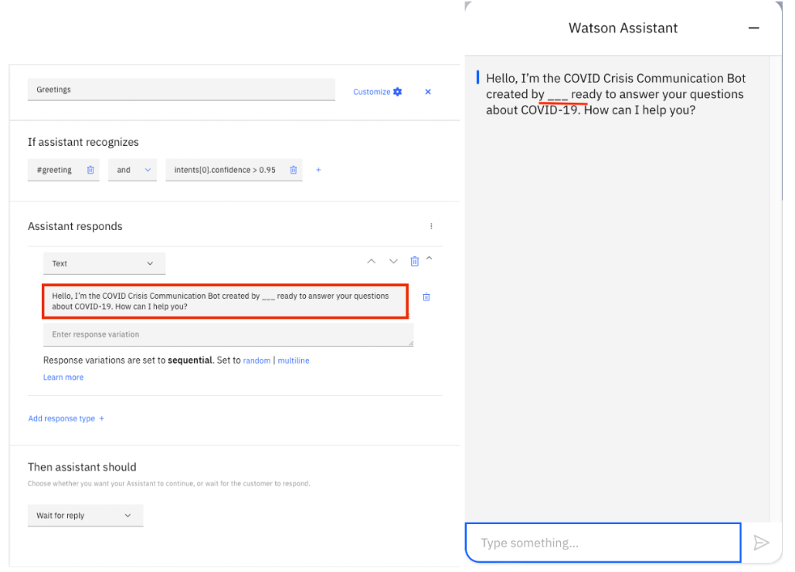

11. Click on **“Try it”** on the upper right and try to ask your new chatbot some questions about COVID-19 defined in Step 6 and Step 7. 
**Important: The chatbot will be training, please wait a few minutes before testing it out.**

12. **Ask at least 3 questions in the “try it out” panel. Submit the screenshot (similar to the one below) of the questions to get credit**

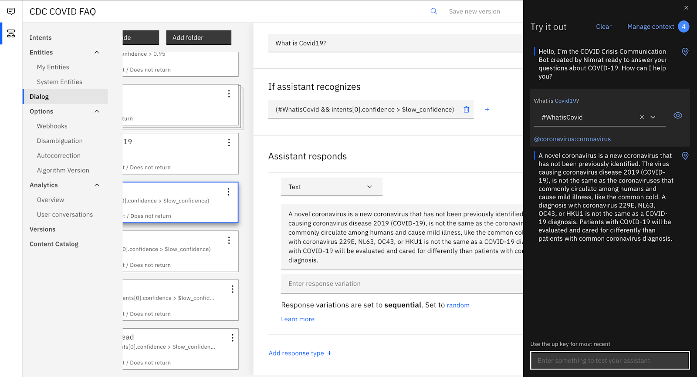

If the answer doesn’t appear for a question (for example, the user asked “What was Covid19 named after?”), select the relevant topic from the dropdown to train your assistant (as shown in the below screenshot, #Whythename was selected).

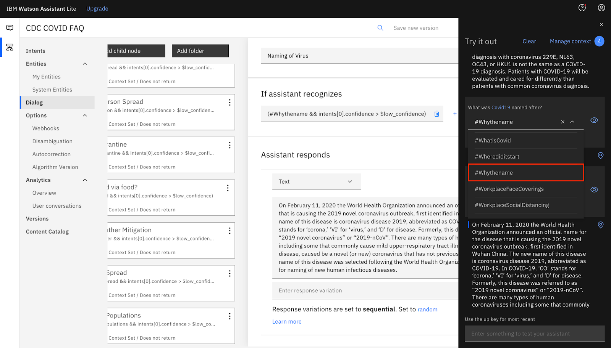

After the assistant is trained as just shown, it will show the updated answer when asked the same question again.

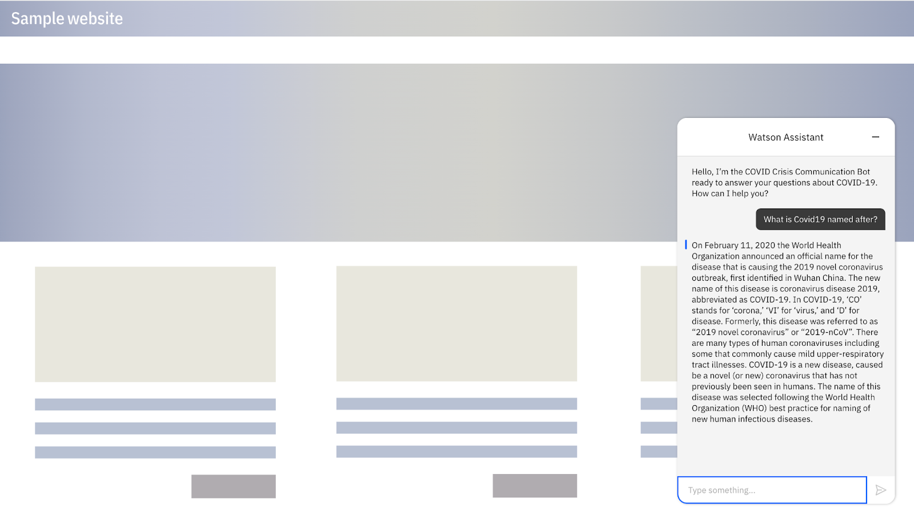

13. Click on **Preview** on the side bar. 

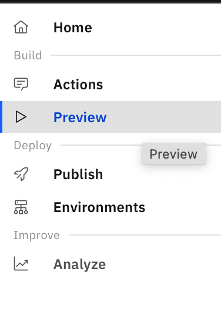 

14. On the “Preview assistant” page, click on **“Customize web chat”.**

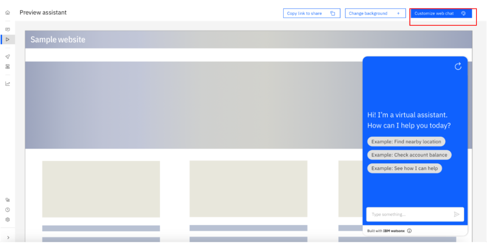

15. Select the “Home screen” tab and switch the setting from on to off. 

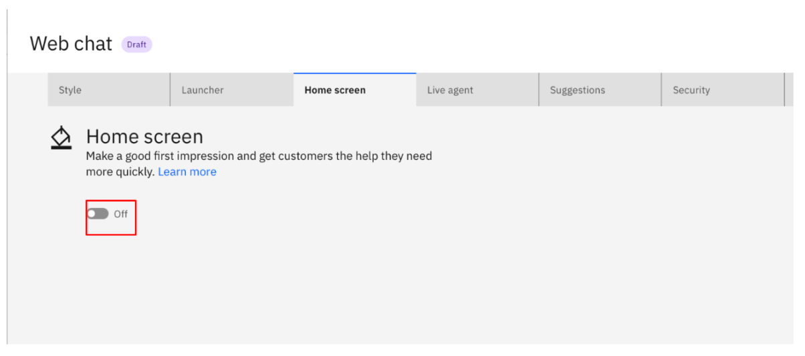 

16. Back on the “Preview assistant” page, you can see how your chatbot will look to users on the right hand side. Copy the URL generated under **“Copy link to share”** to send it out to users. 

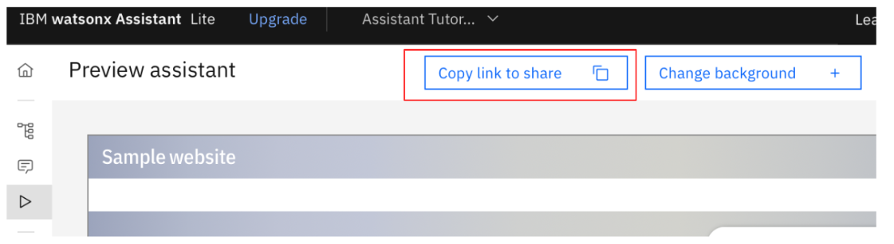

17. Test the chatbot again on a browser on your computer or mobile devices.

18. Take a screenshot of your chatbot launched on your mobile device to get credit for your work. 

**Note:** Should be similar to the image from Step 10

**_***Disclaimer: The content used in this COVID FAQ chatbot was adapted from IBM Call for Code 2020 tutorial. The content is used for learning Watson Assistant only. For COVID-19 related information, please visit the most up-to-date information from CDC._**

---

## ✅ Congratulations on completing the lab! - your Watson Assistant setup is now complete.

